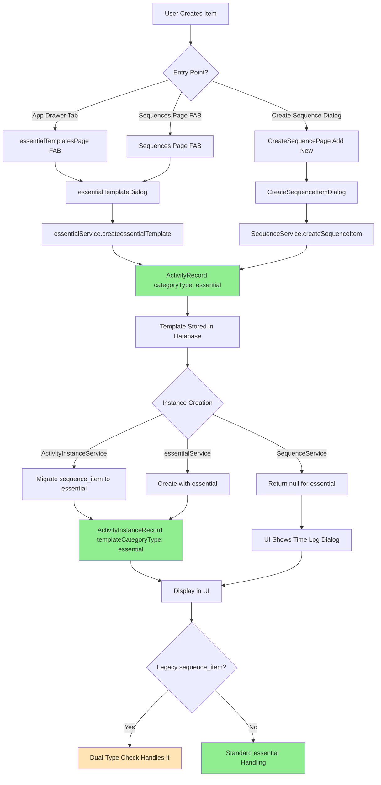

# Sequence Item vs essential Item Migration Audit

## Executive Summary

The migration from "sequence items" to "Essential Activities" is **incomplete**. While new items are created with `categoryType: 'essential'`, the codebase still contains extensive legacy handling for `'sequence_item'` type. Both types coexist in the codebase, creating confusion and potential bugs.

**Key Finding**: No new `'sequence_item'` types are being created, but the codebase maintains dual-type checks everywhere to support legacy data.

---

## 1. Backend Creation Logic

### 1.1 Sequence Service (`lib/Helper/backend/sequence_service.dart`)

**Method: `createSequenceItem()`** (Lines 227-253)
- **Creates**: `ActivityRecord` with `categoryType: 'essential'`
- **Purpose**: Legacy method name, but creates Essential Activities
- **Called from**: `CreateSequenceItemDialog` (in-dialog creation)
- **Note**: Despite the method name, it creates `'essential'` type, not `'sequence_item'`

```dart
// Line 250: Creates as essential
categoryType: 'essential', // Sequence items are essential
```

**Method: `createInstanceForSequenceItem()`** (Lines 255-347)
- **Handles**: Both `'essential'` and legacy `'sequence_item'` types
- **Behavior**: Returns `null` for Essential Activities (signals UI to show time log dialog)
- **Migration check**: Line 276 checks for both types

### 1.2 essential Service (`lib/Helper/backend/essential_service.dart`)

**Method: `createessentialTemplate()`** (Lines 18-45)
- **Creates**: `ActivityRecord` with `categoryType: 'essential'`
- **Purpose**: Primary method for creating essential templates
- **Called from**: 
  - `essentialTemplateDialog` (standalone creation)
  - `TaskInstanceService` (when creating from manual time log)

**Method: `createessentialInstance()`** (Lines 48-118)
- **Creates**: `ActivityInstanceRecord` with `templateCategoryType: 'essential'`
- **Purpose**: Creates instances with time logs for Essential Activities

### 1.3 Activity Instance Service (`lib/Helper/backend/activity_instance_service.dart`)

**Migration Logic** (Lines 104-107):
- Automatically migrates `'sequence_item'` to `'essential'` when creating instances
- This ensures new instances never have `'sequence_item'` type

```dart
// Migrate legacy 'sequence_item' to 'essential'
templateCategoryType: template.categoryType == 'sequence_item'
    ? 'essential'
    : template.categoryType,
```

### 1.4 Task Instance Service (`lib/Helper/backend/task_instance_service.dart`)

**Migration Logic** (Lines 1432-1440):
- Migrates legacy `'sequence_item'` instances to `'essential'` during updates
- Ensures consistency when updating existing instances

---

## 2. UI Creation Entry Points

### 2.1 essential Templates Page (App Drawer Tab)

**File**: `lib/Screens/essential/essential_templates_page.dart`

**Entry Point**: FAB button (Line 319-324)
- **Dialog**: `essentialTemplateDialog`
- **Service Call**: `essentialService.createessentialTemplate()`
- **Result**: Creates `ActivityRecord` with `categoryType: 'essential'`

**Flow**:
```
User clicks FAB → essentialTemplateDialog → 
essentialService.createessentialTemplate() → 
ActivityRecord with categoryType: 'essential'
```

### 2.2 Sequences Page FAB

**File**: `lib/Screens/Sequence/sequence.dart`

**Entry Point**: FAB button (Lines 383-395)
- **Dialog**: `essentialTemplateDialog`
- **Service Call**: `essentialService.createessentialTemplate()`
- **Result**: Creates `ActivityRecord` with `categoryType: 'essential'`

**Flow**:
```
User clicks FAB on Sequences page → essentialTemplateDialog → 
essentialService.createessentialTemplate() → 
ActivityRecord with categoryType: 'essential'
```

### 2.3 Create Sequence Dialog - "Add New" Option

**File**: `lib/Screens/Sequence/create_sequence_page.dart`

**Entry Point**: "Create New" button in activity selection (Line 223-237)
- **Dialog**: `CreateSequenceItemDialog`
- **Service Call**: `SequenceService.createSequenceItem()`
- **Result**: Creates `ActivityRecord` with `categoryType: 'essential'`

**Note**: Despite using `SequenceService.createSequenceItem()`, it creates `'essential'` type, not `'sequence_item'`.

**Flow**:
```
User clicks "Create New" in CreateSequencePage → 
CreateSequenceItemDialog → SequenceService.createSequenceItem() → 
ActivityRecord with categoryType: 'essential'
```

---

## 3. Usage Hotspots & Dual-Type Handling

### 3.1 Files with Dual-Type Checks

The following files check for both `'sequence_item'` and `'essential'` types:

#### Backend Services

1. **`lib/Helper/backend/sequence_service.dart`**
   - Line 34: Comment mentions `sequence_items`
   - Line 276: Checks both types in `createInstanceForSequenceItem()`
   - Line 372: Checks both types in `resetSequenceItems()`

2. **`lib/Helper/backend/backend.dart`**
   - Lines 256-260: Filters out both types unless `includeSequenceItems: true`
   - Comment: "sequence_item is legacy, now all are essential"

3. **`lib/Helper/backend/activity_instance_service.dart`**
   - Line 105: Migrates `'sequence_item'` to `'essential'`
   - Line 552: Excludes both types from normal queries

4. **`lib/Helper/backend/task_instance_service.dart`**
   - Lines 1432-1440: Migrates legacy `'sequence_item'` during updates

5. **`lib/Helper/backend/points_service.dart`**
   - Multiple locations (Lines 33, 59-61, 128, 245, 268): Skips both types (no points)

6. **`lib/Helper/backend/daily_progress_calculator.dart`**
   - Lines 29, 78: Excludes both types from progress calculations

#### UI Components

1. **`lib/Screens/Sequence/create_sequence_page.dart`**
   - Line 71: Filters activities (includes both types)
   - Line 352: Switch case for `'sequence_item'`
   - Lines 408-409, 920-922: Checks both types for UI rendering

2. **`lib/Screens/Sequence/sequence_detail_page.dart`**
   - Line 100: Checks both types for instance creation
   - Line 232: Checks both types for reset functionality

3. **`lib/Screens/Calendar/calendar_page.dart`**
   - Lines 785-786, 898-900, 1010-1011: Handles both types in calendar display

4. **`lib/Screens/Components/manual_time_log_modal.dart`**
   - Line 212: Includes legacy `'sequence_item'` as essential

#### Schema

1. **`lib/Helper/backend/schema/sequence_record.dart`**
   - Line 27: Comment mentions `sequence_items`
   - Line 39: Comment mentions `'sequence_item'` in itemTypes

### 3.2 Display Components

**`lib/Helper/utils/item_component.dart`**
- Lines 1158, 1178: Only checks for `'essential'` (no legacy handling)
- **Issue**: This could miss legacy `'sequence_item'` instances in display

**`lib/Screens/Queue/queue_page.dart`**
- Uses `ItemComponent` which only checks `'essential'`
- Legacy `'sequence_item'` instances may not render correctly

---

## 4. Current State Analysis

### 4.1 What's Working

✅ **New Creation**: All three entry points create `'essential'` type correctly
✅ **Instance Migration**: New instances automatically migrate `'sequence_item'` → `'essential'`
✅ **Backend Queries**: Most services handle both types correctly
✅ **Points System**: Correctly excludes both types from points calculations

### 4.2 What's Incomplete

❌ **Legacy Data**: Existing `'sequence_item'` templates in database remain unchanged
❌ **Dual-Type Checks**: Codebase has 53+ references checking for both types
❌ **Schema Comments**: Still reference `'sequence_item'` in documentation
❌ **Method Names**: `createSequenceItem()` creates `'essential'` (confusing)
❌ **Display Components**: `ItemComponent` only checks `'essential'` (may miss legacy)

### 4.3 Potential Issues

⚠️ **Display Inconsistency**: Legacy `'sequence_item'` instances may not render correctly in `ItemComponent`
⚠️ **Code Confusion**: Method named `createSequenceItem()` creates `'essential'` type
⚠️ **Maintenance Burden**: Dual-type checks throughout codebase increase complexity
⚠️ **Data Inconsistency**: Database may contain both types, causing confusion

---

## 5. Migration Flow Diagram



---

## 6. Recommendations

### 6.1 Immediate Actions (High Priority)

1. **Data Migration Script**
   - Write a Firestore migration script to update all `categoryType: 'sequence_item'` → `'essential'` in `ActivityRecord` collection
   - Update all `templateCategoryType: 'sequence_item'` → `'essential'` in `ActivityInstanceRecord` collection
   - Update `itemTypes` arrays in `SequenceRecord` to replace `'sequence_item'` with `'essential'`

2. **Fix ItemComponent**
   - Update `lib/Helper/utils/item_component.dart` to check for both types:
   ```dart
   if (widget.instance.templateCategoryType == 'essential' || 
       widget.instance.templateCategoryType == 'sequence_item') {
     // Handle as essential
   }
   ```

3. **Rename Method**
   - Consider renaming `SequenceService.createSequenceItem()` to `createessentialItem()` for clarity
   - Or deprecate it and use `essentialService.createessentialTemplate()` everywhere

### 6.2 Code Cleanup (Medium Priority)

1. **Remove Dual-Type Checks**
   - After data migration, remove all `|| categoryType == 'sequence_item'` checks
   - Update all comments that reference `'sequence_item'`
   - Simplify conditionals to only check `'essential'`

2. **Update Schema Comments**
   - Update `sequence_record.dart` comments to remove `'sequence_item'` references
   - Update all inline comments mentioning legacy types

3. **Consolidate Creation Methods**
   - Standardize on `essentialService.createessentialTemplate()` for all creation paths
   - Remove or deprecate `SequenceService.createSequenceItem()`

### 6.3 Testing (Medium Priority)

1. **Test Legacy Data Handling**
   - Verify that existing `'sequence_item'` data still works correctly
   - Test migration script on staging data
   - Verify all three creation entry points work identically

2. **Test Display Components**
   - Verify `ItemComponent` handles both types correctly
   - Test calendar, queue, and sequence detail pages with legacy data
   - Verify points calculations exclude both types

### 6.4 Documentation (Low Priority)

1. **Update Documentation**
   - Remove references to `'sequence_item'` from code comments
   - Update `essential_items.md` to reflect current state
   - Document the migration process for future reference

---

## 7. Files Requiring Changes

### High Priority (Data Migration)
- Firestore migration script (new file)
- `lib/Helper/utils/item_component.dart` (add legacy check)

### Medium Priority (Code Cleanup)
- `lib/Helper/backend/sequence_service.dart` (remove dual checks, rename method)
- `lib/Helper/backend/backend.dart` (remove dual checks)
- `lib/Helper/backend/activity_instance_service.dart` (remove migration code after migration)
- `lib/Helper/backend/task_instance_service.dart` (remove migration code)
- `lib/Helper/backend/points_service.dart` (remove dual checks)
- `lib/Helper/backend/daily_progress_calculator.dart` (remove dual checks)
- `lib/Screens/Sequence/create_sequence_page.dart` (remove dual checks)
- `lib/Screens/Sequence/sequence_detail_page.dart` (remove dual checks)
- `lib/Screens/Calendar/calendar_page.dart` (remove dual checks)
- `lib/Screens/Components/manual_time_log_modal.dart` (remove dual checks)
- `lib/Helper/backend/schema/sequence_record.dart` (update comments)

### Low Priority (Documentation)
- `essential_items.md` (update documentation)
- Various inline comments throughout codebase

---

## 8. Summary

The migration from "sequence items" to "Essential Activities" is **functionally complete** for new data creation, but **structurally incomplete** due to:

1. **Legacy data** still exists in databases with `'sequence_item'` type
2. **Dual-type checks** throughout the codebase (53+ locations)
3. **Inconsistent handling** in some display components
4. **Confusing method names** that don't match their behavior

**Next Steps**: 
1. Run data migration script to update all legacy `'sequence_item'` → `'essential'`
2. Fix `ItemComponent` to handle legacy types
3. Remove all dual-type checks after migration
4. Rename/consolidate creation methods for clarity

Once these steps are complete, the migration will be fully finished and the codebase will be cleaner and more maintainable.
